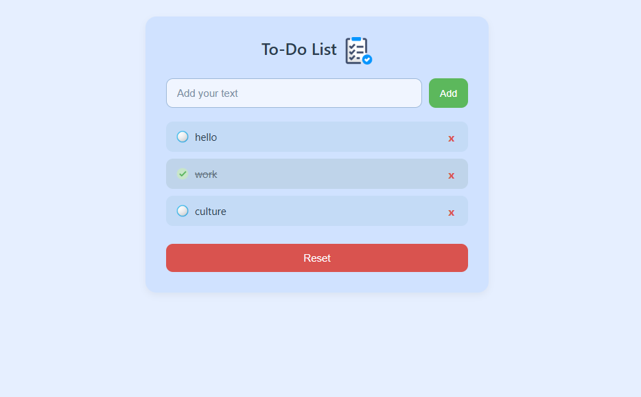

Available in: [🇯🇵 日本語はこちら](README.ja.md)

# 📝 To-Do List App

A simple and beginner-friendly To-Do List web app built using **HTML**, **CSS**, and **Vanilla JavaScript**.

---

## What I Learned

This project was part of my hands-on practice to improve my front-end development skills. Through building this app, I learned:

- How to create and organize a basic project structure
- DOM manipulation in JavaScript (creating, updating, and deleting elements)
- Using **localStorage** to save data in the browser
- Event handling (click, keypress)
- How to use CSS for layout, styling, and UI interactions
- Folder structure and file path management for deployment
- How to display custom checkbox icons using images

---

## Features

- Add new tasks using the input field or Enter key
- Mark tasks as completed (checked)
- Delete tasks individually
- Reset all tasks at once
- Tasks are saved in browser (localStorage)
- Responsive and simple user interface
- Custom checkbox images for checked/unchecked status

---

## Folder Structure


```
To-Do List/
├── index.html                 
├── css/
│   └── style.css            
├── js/
│   └── script.js              
├── images/
│   ├── icon.png               
│   ├── checked.png            
│   └── unchecked.png        
```
---

## How It Works

- When you type a task and press `Add` or `Enter`, it’s added to the list.
- Clicking on the task toggles between completed and not completed (custom checkbox).
- Clicking the ❌ removes that task.
- Clicking `Reset` clears all tasks.
- Data is saved in localStorage, so it stays even after refresh.

---

## Future Plans

- Add dark mode toggle
- Enable task editing
- Add task priority feature
- Deploy the app online via GitHub Pages

---

## Author

**Aman Rai**  
Beginner Web Developer learning JavaScript  
Currently living in **Tokyo, Japan**  
Languages: English, Hindi, Nepali, Japanese (N3)

---

## Preview

